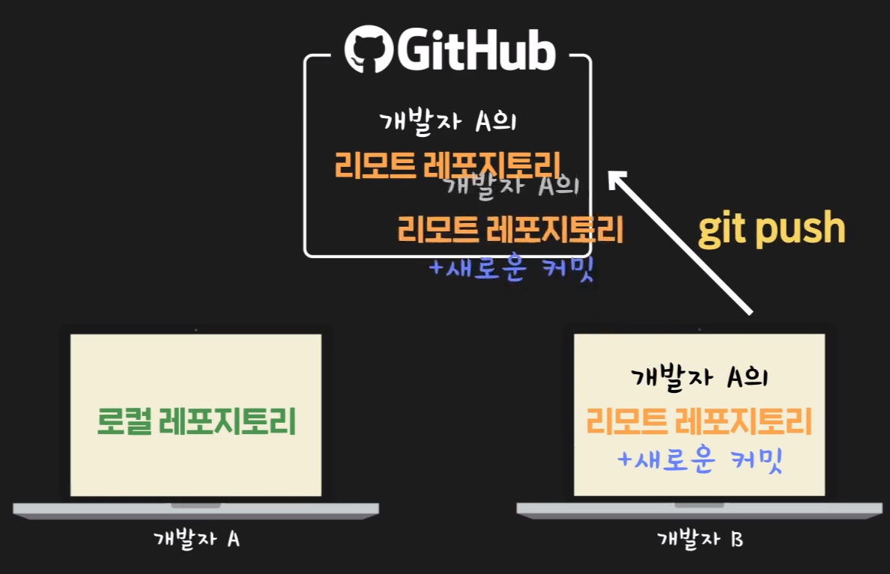

# GitHub 시작하기

 

## 깃허브에서의 Repository / commit

깃허브의 레포지토리: **"원격 레포지토리"** or **"리모트 레포지토리"**

​				↕

내 컴퓨터의 레포지토리: **"로컬 레포지토리"**

 

- 로컬 레포지토리 → 리모트 레포지토리

  로컬 레포지토리에서 새로운 커밋을 했을 때, 리모트 레포지토리에 그 커밋을 보낼 경우 **'git push'**

$ git push -u origin master

> 로컬 레포지토리의 내용을 처음으로 리모트 레포지토리에 올릴 때 사용

 

- 로컬 레포지토리 ← 리모트 레포지토리

  그 반대로 리모트 레포지토리에서 로컬 레포지토리에 가져올 때는 **'git pull'**

 

 

-----

 

#### 그렇다면 리모트 레포지토리를 왜 쓸까?

1. 안정성

   컴퓨터에 문제가 생겨 로컬 레포지토리에 문제가 생겼을 경우, 복원할 방법이 없다. 이때, 다른 컴퓨터에서 리모트 레포지토리에 있는 파일을 다시 가져오기만 하면 된다.

2. 협업 가능

   A가 리모트 레포지토리에 올린 내용을 B가 가져와서 새로운 커밋을 하고 다시 리모트 레포지 토리에 **git push** 을 하고, 새로운 리모트 레포지토리의 내용을 다시 A가 **git pull **로 가져오는 방식을 반복하며 협업할 수 있다.

 

 

-----

 

#### 아무나 리모트 레포지토리에 push 할 수 있을까?

+ 원칙적으로 리모트 레포지토리의 주인인 본인만 할 수 있음
+ 그러나 Manage access 탭에서 다른 사용자들을 해당 리모트 레포지토리에 collaborator로 초대(지정)한다면 할 수 있음

 

-----

 

### 다른 레포지토리 가져오기

README.md 파일을 보면 어떤 프로젝트인지 알기 쉬움

`clone or download` 버튼을 눌러 주소복사 혹은 zip으로 다운로드

1. 주소를 복사 후 터미널로 이동 후 다운받고 싶은 주소로 이동

   $ git clone [복사된 리포지토리 주소(프로젝트의  깃허브상 주소)]

   > git clone : 깃허브 프로젝트의 레포지토리를 그대로 복제

2. zip 다운로드 하여 압축풀기

 

-----

 

### 오픈소스 프로젝트(open source project)

소스 코드가 공개되어 있는 프로젝트

**GitHub**는 이러한 오픈 소스 프로젝트들이 많이 있는 사이트

 

- 오픈소스 프로젝트의 장점

  \- 무료로 사용할 수 있다.

  \- 여러 개발자들이 참여하기 때문에 폐쇄적으로 코드를 관리할 때보다 코드의 신뢰도가 더 높다.(이 부분은 사람마다 의견이 다를 수 있습니다)

  \- 오픈 소스 프로젝트에 참여 중인 다른 개발자들에게 질문을 할 수 있다.

  \- 어떤 프로그램을 개발할 때 특정 분야에서 사실상 표준처럼 사용되는 오픈 소스 프로그램을 많이 활용할수록 전체 개발 속도를 단축시킬 수 있다.

  반면에 단점은

  \- 참여자 수가 많지 않거나, 참여자의 실력이 좋지 않으면 소스 코드의 신뢰성을 보장하기 어렵다. 

  \- 해당 오픈 소스를 사용해서 문제가 생겼을 때 보상을 해주거나, 책임을 질 주체가 없다.

 

-----

 

### README.md 파일

+ 어떤 프로젝트인지 설명
+ 프로그램의 주요 사용법 알려주기
+ 프로그램 실행 전 필요한 사전작업
+ markdown으로 작성

※ 메인 화면에 보여지는 내용이므로 가독성있게 작성하는 것이 중요

